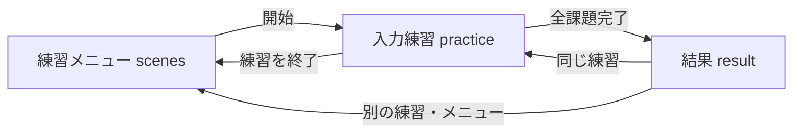

# ゆっくりタイピング 機能仕様・開発ガイド

## 1. 文書の目的

本書は「ゆっくりタイピング」の実装者向け機能仕様を定義する。プロダクト要求は [README.md](./README.md) を参照すること。

記載内容は現在の実装を基準とする。主要なアプリケーションロジックは [app/page.tsx](./app/page.tsx)、教材データは `app/data/exercises/`、表示仕様は [app/globals.css](./app/globals.css) にある。

## 2. 技術構成

| 項目 | 採用技術 |
| --- | --- |
| UI | React 19、TypeScript |
| アプリケーション | Next.js 16互換API、Vinext |
| 開発・ビルド | Vite 8、Vinext |
| ホスティング形式 | Cloudflare Worker互換ESM、OpenAI Sites |
| スタイル | CSS、Tailwind CSSのインポート基盤 |
| 永続化 | ブラウザ `localStorage` |
| サーバーデータ | 使用しない。D1・R2ともに未設定 |
| テスト | Node.js標準テスト、ESLint、ビルド成果物検証 |

アプリ本体は `"use client"` を指定した単一のクライアントコンポーネントで構成される。APIルート、認証、データベース通信は使用しない。

## 3. 主要ファイル

| ファイル | 役割 |
| --- | --- |
| `app/page.tsx` | 画面遷移、入力判定、指マッピング、結果集計、設定・履歴UI |
| `app/data/exercises/index.ts` | カテゴリ別教材データの集約と公開 |
| `app/data/exercises/*.ts` | カテゴリごとの実務文章・Java教材。例文追加時は対象カテゴリのファイルを編集する |
| `app/data/exercises/types.ts` | 教材データの共通型 |
| `app/globals.css` | 全画面のレイアウト、手・指のCSS描画、レスポンシブ表示 |
| `app/layout.tsx` | HTML言語、メタデータ、favicon、グローバルCSS読込 |
| `.openai/hosting.json` | SitesのD1・R2宣言。現在は両方 `null` |
| `vite.config.ts` | Vinext、Sites、Cloudflare Viteプラグイン設定 |
| `scripts/check-node.mjs` | Node.jsの最低バージョン確認 |
| `scripts/build-verified.sh` | タイムアウト付きビルドと成果物検証 |
| `scripts/sites-env.sh` | プロジェクト内へ実行時HOME・キャッシュ・一時領域を分離 |
| `scripts/validate-artifact.sh` | WorkerエントリとSitesマニフェストの検証 |
| `tests/rendered-html.test.mjs` | ビルド済みWorkerのHTML応答とプレビューメタデータ確認 |

## 4. ドメインモデル

### 4.1 `Screen`

```ts
type Screen = "scenes" | "practice" | "result";
```

- `scenes`: 練習メニュー
- `practice`: 入力練習
- `result`: 結果

独立したランディング画面は持たない。初期値は `scenes` とする。

### 4.2 `SceneId`

```ts
type SceneId =
  | "mail"
  | "meeting"
  | "chat"
  | "document"
  | "hello"
  | "variables"
  | "condition"
  | "loop"
  | "method";
```

`mail`〜`document`は実務文章、`hello`〜`method`はJavaとして扱う。

### 4.3 `Exercise`

```ts
type Exercise = {
  id: string;
  context: string;
  description: string;
  input: string;
};
```

- `id`: カテゴリ内で一意な課題ID
- `context`: 課題の用途またはコードテーマ
- `description`: 実務文章では表示する日本語文、Javaでは学習内容の説明
- `input`: 実際に1文字ずつ照合する文字列

実務文章の `input` は日本語IMEで入力するローマ字、Javaの `input` は改行・空白・記号を含むコードとする。助詞の「を」は `wo`、「は」は `ha`、「へ」は `he` とする。「ん」は母音の直前または文末では `nn` とする。

### 4.4 `KeyInfo`

```ts
type KeyInfo = {
  hand: "left" | "right" | "thumb";
  finger: "pinky" | "ring" | "middle" | "index" | "thumb";
  label: string;
  homeKey: string;
  zone: string;
  number: number;
  physicalKey: string;
  shift?: boolean;
};
```

1文字に対し、担当する手、指、ホームキー、担当範囲、指番号、物理キー、Shift要否を保持する。

### 4.5 `Settings`

```ts
type Settings = {
  sound: boolean;
  animation: boolean;
  largeGuide: boolean;
  exerciseCount: number;
  fontScale: number;
};
```

既定値は次のとおり。

| 項目 | 既定値 | 許容値・意味 |
| --- | ---: | --- |
| `sound` | `false` | 正誤効果音の有無 |
| `animation` | `true` | 対象指の強調アニメーション |
| `largeGuide` | `true` | 手の図を大きく表示 |
| `exerciseCount` | `5` | 1〜16課題。カテゴリの収録数を上限とする |
| `fontScale` | `1` | 0.9、1.0、1.1、1.2 |

### 4.6 `SessionRecord`

```ts
type SessionRecord = {
  id: string;
  date: string;
  scene: string;
  accuracy: number;
  correct: number;
  exerciseCount: number;
  mistakes: Record<string, number>;
  targetFingerErrors: Record<string, number>;
};
```

- `mistakes`: 実際に誤入力した文字別の回数
- `targetFingerErrors`: 誤入力時の正解文字に割り当てられた担当指別の回数
- `targetFingerErrors`は実際に使用された指を表さない

## 5. 画面遷移



設定、履歴、実務文章の開始前確認は、通常画面の上に表示するモーダルであり、`Screen`は変更しない。一時停止モーダルも `practice` の内部状態として扱う。

画面変更時は `window.scrollTo(0, 0)` を実行する。

## 6. 画面別機能仕様

### 6.1 練習メニュー `scenes`

初期選択は `mail` とする。

表示内容:

- サービスロゴ
- 練習履歴ボタン
- 設定ボタン
- 選択中の練習と開始エリア
- 実務文章4カテゴリ
- Java 5カテゴリ

カテゴリカードを押すと `scene` を更新し、選択中のカードへ `aria-pressed="true"` を設定する。

開始エリアには次を表示する。

- 選択中のカテゴリ名
- 最初の課題の `context`
- 設定中の課題数 / カテゴリの収録数
- 開始ボタン
- 練習量を変更するボタン

デスクトップでは開始エリアを `position: sticky` とし、画面上部から開始できる状態を維持する。モバイル幅では通常フローへ戻す。

トップ画面は練習選択を主役とし、配色、余白、カード選択時の控えめなアニメーションで落ち着いた印象を作る。アニメーションは設定とOSの視差効果を減らす指定に従う。

実務文章の開始ボタンは確認モーダルを開き、最初の課題の `context` と `description` を表示する。課題を完了したときも次の課題へ進む前に同じモーダルを表示する。Javaカテゴリでは確認モーダルを省略し、直接 `practice` へ進む。

### 6.2 入力練習 `practice`

練習開始時に次の状態を初期化する。

```text
exerciseIndex = 0
charIndex = 0
correct = 0
mistakes = {}
targetFingerErrors = {}
wrongKey = null
```

セッション開始時に選択カテゴリの全課題をFisher–Yates法でシャッフルし、`settings.exerciseCount` と収録数の小さい方を先頭から `slice` して使用する。直前セッションと先頭課題が同じ場合は先頭2件を入れ替える。実務文章は最大16文、Javaは最大12本とする。

#### 上部ツールバー

- カテゴリ名
- 現在の課題番号 / 課題数
- セッション全体の細い進捗バー
- 一時停止ボタン

進捗バーの割合は次式で算出する。

```text
(完了済み課題の文字数合計 + 現在課題の charIndex) / 全課題の文字数合計
```

数値は画面へ表示せず、アクセシブル名にのみ含める。

#### 入力対象エリア

- 実務文章: `description` の日本語文を大きく表示
- Java: `input` のコード全文を等幅フォントで省略せず表示し、現在の1文字をコード内で強調
- `context`を課題の短い用途として入力対象の直前に表示
- 実務文章のみ、下部にローマ字の全文字列を従来比約1.5倍の文字サイズで表示
- 実務文章は、`charIndex / input.length` の進捗を `description` の文字位置へ対応させ、例文そのものを入力済み・現在位置・未入力に分けて表示
- 正しい1打ごとに現在位置へ穏やかな波紋を表示。次の入力を妨げず、`animation`設定とOSの視差効果を減らす指定に従う
- 独立した「次に入力」カードと通常ステータスは表示しない

入力位置表示では次の表現を使用する。

- 入力済み: `done` クラス
- 現在位置: `current` クラス
- Space: `·`。Java課題のみで使用
- 改行: `↵` と実改行

実務文章の `input` は単語間スペースを含まない。日本語文のローマ字入力ではSpaceを要求せず、発音ではなく日本語IMEのキー入力に合わせる。

#### 指ガイドエリア

- `targetInfo.label` から左右の手と指名を表示
- `HandMap`で左右の手をCSS描画
- 対象指へ `target` クラスを付与
- 対象外の手へ `muted` クラスを付与
- 担当範囲、物理キー、ホームキーへ戻す案内を表示
- Shift対象では反対側のShiftキーを表示

練習モードでは手の図を優先し、詳細キーボード図と凡例はCSSで非表示にする。

デスクトップでは上段を入力対象、下段を指ガイドとする固定高さレイアウトを使用する。720px以下では固定高さを解除し、縦スクロールを許可する。

### 6.3 一時停止

次のいずれかで `paused = true` とする。

- 一時停止ボタン
- Escapeキー

一時停止中はグローバルなキー入力ハンドラを無効化する。

操作:

- 入力を再開: 現在位置を維持して `paused = false`
- 最初からやり直す: `startPractice()`を再実行
- 練習を終了: `scenes`へ移動

### 6.4 結果 `result`

最終課題の最終文字が正しく入力されると `finishSession()` を実行する。

正確率:

```text
attempts = correct + 誤入力回数合計
accuracy = round(correct / attempts * 100)
```

`attempts`が0の場合は100%とする。

表示内容:

- 正確率
- 正しく入力した文字数
- 誤入力回数
- 完了した課題数
- 誤入力の多いキー上位5件
- 担当指別誤入力上位4件

経過時間、WPM、入力速度は計測・保存・表示しない。

### 6.5 設定モーダル

各変更はReactの `settings` 状態へ即時反映する。「保存して閉じる」はモーダルを閉じる操作であり、別の確定処理は持たない。

`fontScale`はCSSカスタムプロパティ `--font-scale`へ渡す。

`largeGuide`はルートへ `large-guide`または`compact-guide`クラスを付与する。

`animation = false`の場合は `no-animation`クラスを付与し、アニメーションとトランジションを無効化する。OSの `prefers-reduced-motion`にも対応する。

### 6.6 履歴モーダル

- 履歴は新しい順で保持する。
- セッション保存時に最大40件へ切り詰める。
- モーダルには先頭12件を表示する。
- 表示項目はカテゴリ、実施日、正確率とする。
- 全削除時はReact状態を空配列にし、ローカルストレージの履歴キーも削除する。

## 7. キー入力判定

### 7.1 イベント

`practice`画面かつモーダルが閉じ、一時停止していない場合に `window` の `keydown` を監視する。

次の入力は判定対象外とする。

- キーリピート
- Meta、Control、Altを伴う入力
- Tab
- 定義されていないキー

Enterは `\n`、旧ブラウザの `Spacebar` は半角Spaceへ正規化する。

### 7.2 正解

正規化した `event.key` と `exercise.input[charIndex]` を完全一致で比較する。

一致した場合:

1. `correct`を1増やす。
2. 誤入力表示を解除する。
3. 正解音を再生する。
4. 次の文字、次の課題、または結果画面へ進む。

大文字と小文字は区別する。

### 7.3 誤入力

不一致の場合:

1. `mistakes[event.key]`を1増やす。
2. `targetFingerErrors[targetInfo.label]`を1増やす。
3. 入力位置は変更しない。
4. 追加のメッセージは表示せず、現在の入力位置と指ガイドを維持する。
5. 誤入力音を再生する。
6. 内部の `wrongKey` 状態を650ms後に解除する。

### 7.4 効果音

Web Audio APIで45msの短い音を生成する。

| 種別 | 周波数 | ゲイン |
| --- | ---: | ---: |
| 正解 | 470Hz | 0.018 |
| 誤入力 | 190Hz | 0.026 |

Web Audio APIが利用できない場合は例外を無視し、視覚フィードバックのみ継続する。

## 8. キー・指マッピング

### 8.1 英字

ホームポジションを `A S D F` / `J K L ;` とし、一般的なタッチタイピングの担当列へ割り当てる。

| 指 | 主な担当 |
| --- | --- |
| 左小指 | Q、A、Z |
| 左薬指 | W、S、X |
| 左中指 | E、D、C |
| 左人差し指 | R、T、F、G、V、B |
| 右人差し指 | Y、U、H、J、N、M |
| 右中指 | I、K、`,` |
| 右薬指 | O、L、`.` |
| 右小指 | P、`;`、`:`、`/`、`[`、`]`、`-`、Enter |
| 親指 | Space |

### 8.2 数字

- 1: 左小指
- 2: 左薬指
- 3: 左中指
- 4、5: 左人差し指
- 6、7: 右人差し指
- 8: 右中指
- 9: 右薬指
- 0: 右小指

### 8.3 Shift

大文字およびShift記号では `shift = true` とする。対象キーが左手担当なら右Shift、右手担当なら左Shiftを案内する。

記号の物理キー案内は日本語JIS配列を基準とする。主な例:

| 入力文字 | 物理キー |
| --- | --- |
| `"` | `2` |
| `=` | `-` |
| `+` | `;` |
| `*` | `:` |
| `{` | `[` |
| `}` | `]` |

## 9. 永続化

保存先はブラウザの `localStorage` とする。

| データ | キー | 値 |
| --- | --- | --- |
| 設定 | `yubitore-settings-v2` | `Settings`のJSON |
| 履歴 | `yubitore-history-v2` | `SessionRecord[]`のJSON |

JSONの読込に失敗した場合は、設定は `DEFAULT_SETTINGS`、履歴は空配列へフォールバックする。

サーバー保存、ユーザー識別、端末間同期は行わない。

## 10. コンテンツ追加手順

1. `SceneId`へカテゴリIDを追加する。
2. `SCENES`へタイトル、説明、マークを追加する。
3. `PRACTICAL_SCENES`または`JAVA_SCENES`へIDを追加する。
4. `EXERCISES`へ8件の `Exercise`を追加する。
5. `input`の全文字が `hasKeyInfo()` で対応可能か確認する。
6. 実際に最後まで入力し、次の文字と指ガイドが一致することを確認する。

未定義文字は入力判定対象外となるため、課題へ追加する前に `KEYS`、`NUMBER_KEYS`、`SHIFT_SYMBOLS`のいずれかへ割り当てる必要がある。

## 11. ローカル開発

### 11.1 前提

- macOSまたはLinux
- Node.js 22.13.0以上
- npm

リポジトリには `.nvmrc` と `.node-version` があり、検証済みNode.jsバージョンを指定する。

### 11.2 macOSでの起動

```bash
npm install
npm run dev
```

Viteが表示する `Local` URLをブラウザで開く。5173番ポートが使用中の場合、Viteは別の空きポートを使用する。

Linux CI向けの `npm run install:ci` は `flock`、GNU `timeout`、`curl`、`sha256sum`を必要とする。通常のmacOS開発では使用しない。

### 11.3 npmスクリプト

| コマンド | 内容 |
| --- | --- |
| `npm run dev` | 開発サーバーを起動 |
| `npm run lint` | ESLintを実行 |
| `npm run build` | タイムアウト付きVinextビルドと成果物検証 |
| `npm test` | ビルド、成果物検証、HTML応答テスト |
| `npm run start` | ビルド済みアプリを起動 |
| `npm run validate:artifact` | 既存のビルド成果物を再検証 |
| `npm run install:ci` | Linux CI向けの排他・タイムアウト付き `npm ci` |
| `npm run db:generate` | Drizzleマイグレーション生成。現在はDB未使用 |

## 12. ビルド・ホスティング

`npm run build`は次を実行する。

1. Node.jsバージョンを検証する。
2. `vinext build`を既定3分のタイムアウト付きで実行する。
3. `dist/server/index.js`のESM `default.fetch`を検証する。
4. `dist/.openai/hosting.json`が有効なJSONであることを検証する。

`.openai/hosting.json`は現在次の状態であり、永続的なクラウドリソースを使用しない。

```json
{
  "d1": null,
  "r2": null
}
```

## 13. テスト仕様

### 13.1 自動テスト

現在の `tests/rendered-html.test.mjs` は、ビルド済みWorkerにHTMLリクエストを送り、次を確認する。

- HTTP 200を返すこと
- `Content-Type`がHTMLであること
- `codex-preview=development`メタデータを含むこと

`npm run lint`で型を含む静的なコード品質を確認し、`npm test`でビルド成果物まで確認する。

### 13.2 主要な手動確認

- 初期表示が練習メニューであること
- 全9カテゴリを選択できること
- 実務文章では各課題の開始前に確認モーダルが表示され、Javaでは直接練習が始まること
- セッションごとに課題がシャッフルされること
- 実務文章の例文上で入力済み・現在位置・未入力が区別されること
- 実務文章のローマ字が従来比約1.5倍で表示されること
- 実務文章では課題数1〜16、Javaでは課題数1〜12が反映されること
- 実務文章でSpace入力を要求されないこと
- 正解時のみ次の文字へ進むこと
- 誤入力時に位置が変わらないこと
- Space、Enter、大文字、Shift記号の案内が正しいこと
- 一時停止、再開、やり直し、終了が動作すること
- 最終課題後に結果が正しく集計されること
- 設定と履歴が端末内へ保存されること
- 1024×720以上で入力対象と手の図を同一画面内に確認できること

## 14. 既知の制約

- 実際に使用した指は検出せず、正解文字の標準担当指のみ表示する。
- 物理キー案内は日本語JIS配列を基準とする。
- IMEの状態はアプリから強制変更しない。
- 対応表にない文字は入力対象として扱えない。
- 制限時間、経過時間、速度、WPM、ランキングは計測・集計・表示しない。
- 履歴と設定はブラウザ単位であり、端末間同期しない。
- 720px以下では1画面固定を解除し、縦スクロールを許可する。
- 自動テストはビルドとHTML応答が中心で、キー入力のE2Eテストは未整備である。
